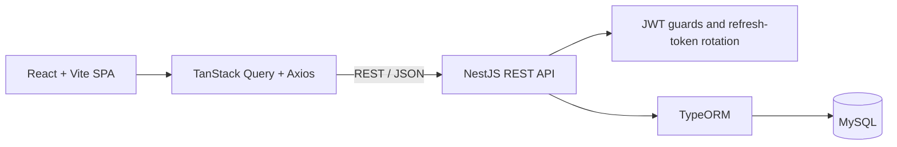

# 🧭 DevAtlas

DevAtlas is a full-stack learning workspace for developers. It helps users turn
technical goals into structured learning paths, break them into topics and
study sections, save notes and code snippets, and track progress from one
dashboard.

The project combines a React single-page application with a modular NestJS REST
API and a MySQL database.

## Features

- Create learning paths and classify them by technical category and difficulty.
- Organize each path into ordered topics and focused study sections.
- Record descriptions, confidence levels, and reusable code snippets.
- Mark sections as complete and view aggregated progress across topics and paths.
- Browse learning paths through a paginated grid or list dashboard.
- Manage profile information, passwords, account deletion, and display settings.
- Use a responsive interface with persistent light and dark themes.

## Authentication and data security

- Short-lived JWT access tokens protect API requests.
- Refresh tokens are delivered through path-scoped, HTTP-only cookies.
- Refresh-token values are SHA-256 hashed before database storage.
- Token rotation uses a database transaction and pessimistic lock to prevent
  concurrent reuse.
- Passwords are salted and hashed with Node.js `scrypt`.
- Global NestJS guards secure routes by default, with explicit public-route
  metadata for authentication endpoints.
- Ownership-scoped queries prevent users from accessing another user's learning
  paths, topics, or sections.
- DTO validation and response serialization constrain request data and exclude
  sensitive fields.

## Architecture



The frontend uses a feature-based structure, protected nested routes, lazy-loaded
pages, reusable UI components, and TanStack Query for server-state caching,
pagination, mutations, and cache invalidation.

The backend is split into authentication, user, learning-path, topic, and section
modules. Each domain module follows NestJS controller/service/repository
boundaries and persists data through TypeORM.

### Domain model

```text
User
└── Learning Path
    └── Topic
        └── Section
```

Topics have a stable display order. Sections store study content, optional code
snippets, confidence levels, and completion state. Denormalized counters on
topics and learning paths provide progress summaries without repeatedly
recalculating the full hierarchy.

### Session flow

1. Login or signup returns an access token and sets a refresh-token cookie.
2. The client keeps the access token in memory and attaches it to API requests.
3. When an access token expires, an Axios interceptor performs one refresh and
   replays the failed request.
4. Concurrent refresh attempts share the same request so a rotating token is
   not consumed twice.
5. Logout revokes the stored refresh token and clears local session state.

## Tech stack

### Frontend

- React 19, TypeScript, and Vite
- React Router
- TanStack React Query
- Axios
- React Hook Form
- Tailwind CSS 4
- Lucide React and React Toastify

### Backend

- Node.js, TypeScript, and NestJS 11
- TypeORM and MySQL
- JWT authentication
- `class-validator` and `class-transformer`
- Jest and Supertest

## Project structure

```text
DevAtlas/
├── backend/
│   ├── src/
│   │   ├── authentication/
│   │   ├── learning-path/
│   │   ├── section/
│   │   ├── topic/
│   │   ├── user/
│   │   └── shared/
│   ├── test/
│   └── package.json
├── frontend/
│   ├── public/
│   ├── src/
│   │   ├── features/
│   │   │   ├── authentication/
│   │   │   └── dashboard/
│   │   ├── home/
│   │   ├── layout/
│   │   └── shared/
│   └── package.json
└── README.md
```


## API overview

The main API groups are:

- `/api/auth` — signup, login, logout, and refresh-token rotation
- `/api/user` — current user, profile, password, and account management
- `/api/learning-path` — learning-path management and paginated listing
- `/api/topic` — ordered topics within a learning path
- `/api/section` — study sections and completion tracking

All routes are authenticated by default except the public authentication
endpoints.

## Development status

DevAtlas is under active development. Core authentication, learning-path
management, nested topic and section workflows, progress tracking, account
settings, and theming are implemented. Automated frontend tests, production
database migrations, and some dashboard controls are still planned.
