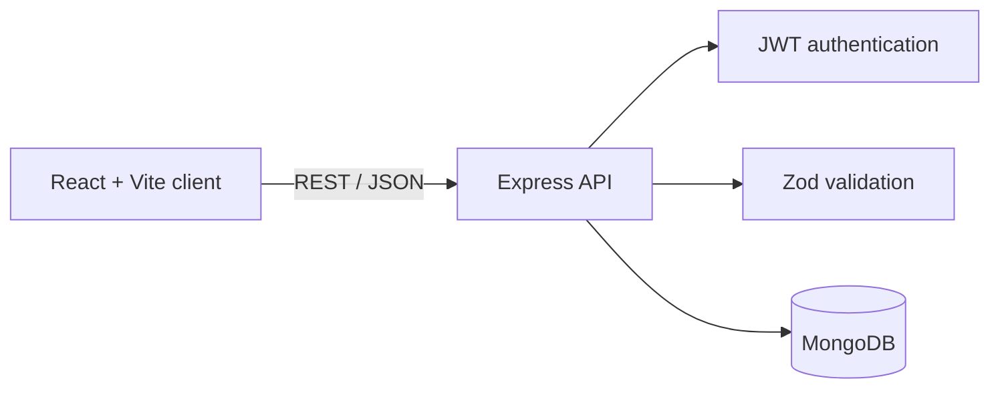

# 🧭 DevAtlas

DevAtlas is a full-stack learning-path manager for developers. It provides a
single place to create technical roadmaps, organize them into sections and
topics, and track progress from start to completion.

The project combines a React dashboard with a REST API backed by MongoDB. It is
currently under active development.

## ✨ Features

- **Structured learning roadmaps** — organize a learning path into ordered
  sections and focused topics.
- **Progress-focused workspace** — track section and topic states and visualize
  completion directly from the dashboard.
- **Personalized path organization** — group goals by technical category and
  difficulty, from beginner through advanced.
- **Secure user accounts** — password hashing, expiring JWT sessions, profile
  management, password changes, and account deletion.
- **Flexible dashboard experience** — switch between responsive grid and list
  layouts to review learning paths comfortably.
- **Persistent theming** — light and dark preferences are saved across sessions.
- **Reliable data boundaries** — Zod validation, ownership checks, and
  centralized error handling protect the learning domain.

## 🏗️ Architecture



The frontend is organized by feature and uses React Query for server-state
management. The backend follows a route/controller/service/repository structure
for its learning resources.

### 🧩 Data Model

```text
User
└── Learning Path
    └── Section
        └── Topic
```

Learning paths belong to a user. Sections belong to a learning path, and topics
belong to a section. Section and topic records carry progress states such as
`NOT_STARTED`, `IN_PROGRESS`, and `COMPLETED`.

## 🛠️ Tech Stack

### ⚛️ Frontend

- React 19 and TypeScript
- Vite 8
- React Router
- TanStack React Query
- Tailwind CSS 4
- React Hook Form
- Axios
- Lucide React and React Toastify

### 🖥️ Backend

- Node.js and TypeScript
- Express 5
- MongoDB and Mongoose
- JSON Web Tokens
- bcrypt.js
- Zod

## 📁 Project Structure

```text
DevAtlas/
├── backend/
│   ├── src/
│   │   ├── features/
│   │   │   ├── authentication/
│   │   │   ├── learning/
│   │   │   │   ├── learning-path/
│   │   │   │   ├── section/
│   │   │   │   └── topic/
│   │   │   └── user/
│   │   ├── shared/
│   │   └── app.ts
│   ├── package.json
│   └── tsconfig.json
├── frontend/
│   ├── public/
│   ├── src/
│   │   ├── features/
│   │   │   ├── authentication/
│   │   │   └── dashboard/
│   │   ├── home/
│   │   ├── layout/
│   │   └── shared/
│   ├── package.json
│   └── vite.config.ts
└── README.md
```

## 🚧 Development Status

DevAtlas is a work in progress. The core UI and domain layers are present.


